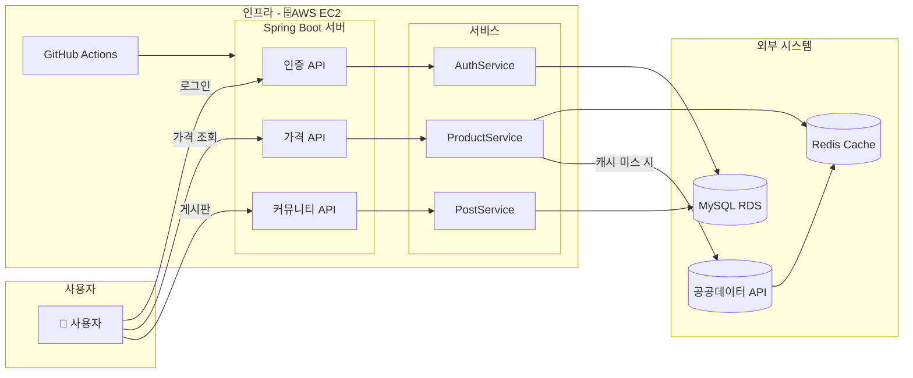

# 농수축산물 도매가격 조회 / 커뮤니티

## 1. 프로젝트 소개

농림축산식품 공공데이터 포털에서 제공하는 API를 활용하여 농수축산물의 도매가격 정보를 제공하고 사용자들이 정보를 공유할 수 있는 커뮤니티를 만들었습니다.

프로젝트를 진행하며 실제 서비스 환경을 목표로 서비스를 개발하고 성능을 개선해왔습니다. **N+1 문제 해결, Redis 캐싱, 동적 쿼리 구현, 클라우드 인프라 설계, CI/CD 파이프라인 구축** 등 백엔드 개발자로서 사용자에게 더 나은 서비스를 제공하기 위한 고민을 했습니다.

---

###  **프로젝트 URL & API 문서**

- **[프로젝트 URL](http://3.34.46.39:8080)**
- **[API 문서 (Swagger)](http://3.34.46.39:8080/swagger-ui/index.html)**

---

## 2. 주요 기능

- **가격 조회**: 지도를 통해 전국의 주요 도매시장을 선택하고, 날짜 별 농수축산물 도매가격을 조회합니다.
- **검색**: 특정 품목, 품목 분류, 날짜 등 다양한 조건으로 가격 정보를 필터링하고 검색할 수 있습니다.
- **사용자 인증**: JWT 기반의 회원가입 및 로그인 기능을 제공합니다.
- **커뮤니티**: 각 도매시장별 게시판에서 사용자들이 소통할 수 있습니다.

## 3. API 명세

| 기능 | HTTP Method | URL | 설명 |
| --- | --- | --- | --- |
| **회원가입** | `POST` | `/api/auth/register` | 신규 사용자 등록 |
| **로그인** | `POST` | `/api/auth/login` | 로그인 및 JWT 발급 |
| **게시글 작성** | `POST` | `/api/posts` | 신규 게시글 작성 (인증 필요) |
| **게시글 목록 조회**| `GET` | `/api/posts` | 게시글 목록 조회 |
| **가격 정보 조회** | `GET` | `/api/prices` | 가격 정보 조회 |

## 4. 적용 기술 및 개발 환경

- **Backend**: `Java`, `Spring Boot`, `Spring Security`, `Spring Data JPA`
- **Database**: `MySQL`, `QueryDSL`, `Redis`
- **DevOps**: `GitHub Actions`, `AWS EC2`, `AWS RDS`
- **Test**: `JUnit 5`, `Mockito`, `Jmeter`

## 5. 전체 시스템 아키텍처

<b>아키텍처 확인</b>

전체 시스템 아키텍처 다이어

## 6. 문제 해결 / 개선

- **Redis 캐싱 적용**
    - 공공데이터 API 응답을 Redis에 캐싱하여 조회 성능을 개선했습니다.(동일 데이터 100회 동시 조회 기준 평균 응답시간 2370ms → 150ms)

- **N+1 문제 해결**
    - 게시글 목록을 조회할 때 게시글을 가져오는 쿼리 이후 각 게시글의 작성자 정보를 얻기 위해 N개의 추가 쿼리가 발생하는 N+1 문제가 발생하였고, 이를 Fetch Join을 적용해 해결했습니다.

- **인덱스 최적화**
    - 적절한 인덱스를 적용해 Full Table Scan을 방지하고 효율적으로 조회할 수 있도록 하였습니다.

- **CI/CD 파이프라인 구축**
    - GitHub Actions를 기반으로 빌드 → 테스트 → 배포 과정을 자동화하는 파이프라인을 구축했습니다.

- **민감정보 분리**
    - 각종 키, 계정 정보 등의 민감정보를 코드에서 분리해 따로 주입하는 방식을 적용했습니다.

## 7. 고민중(?)

- **마이크로 서비스 분리**
    - 도매가격 조회, 커뮤니티 서비스 분리
 
- **비동기 이벤트 처리**

- **ElasticSearch 도입**
 

---

> **Note**: 이 프로젝트의 프론트엔드(HTML, CSS, JavaScript) 부분은 AI의 도움을 받아 구현했습니다.
